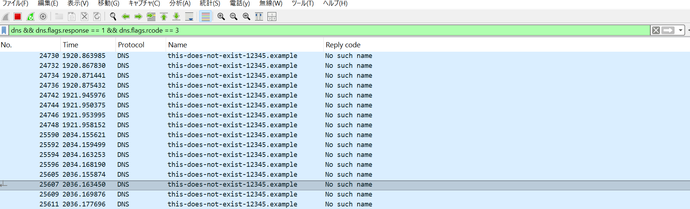

# DNS異常検知ラボ（NXDOMAIN）

目的：NXDOMAIN（存在しない名前）の見え方を体験し、“最初の10分”の観点を作る。

- まずは `nslookup this-does-not-exist-12345.example` を実行して NXDOMAIN を発生させる
- Wiresharkで `dns && dns.flags.response==1 && dns.flags.rcode==3` を表示
- 画像は実IPや端末名が映らないように切り抜き

（下にスクショを後で貼る予定）

